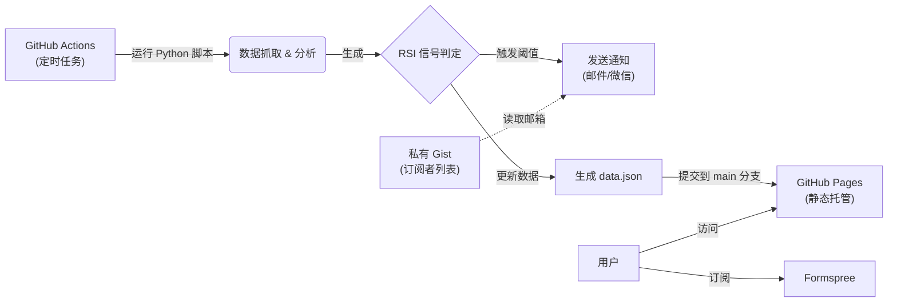

# 📈 JTrading - 红利低波ETF (512890) 智能监控系统

[](https://github.com/Pear56/JTrading/actions/workflows/rsi_check.yml)
[](https://pear56.github.io/JTrading/)
[](https://opensource.org/licenses/MIT)

**JTrading** 是一个基于 GitHub Actions 的 Serverless 自动化交易辅助系统。它专为 **红利低波ETF (512890)** 设计，能够全自动监控 RSI 技术指标，提供现代化的可视化看板，并在出现买卖信号时通过多渠道发送提醒。

---

## ✨ 核心功能

### 1. 📊 现代化可视化看板
- **环形进度仪表盘**: 采用全新的环形进度条设计，视觉焦点集中，RSI 数值一目了然。
- **动态状态反馈**: 仪表盘颜色根据 RSI 状态（超买/超卖/中性）自动变化 (绿/红/灰)。
- **响应式布局**: 基于 CSS Grid 的自适应设计，完美适配桌面大屏与移动端设备。
- **深色模式**: 支持系统级 Dark Mode，夜间查看更护眼。
- **实时数据**: 展示最新价格、RSI 数值及明确的操作建议。

### 2. 🤖 全自动智能监控
- **交易时段巡航**: 仅在 A 股交易时段 (北京时间 09:00 - 15:00) 每小时自动运行一次，节省资源。
- **数据持久化**: 每次运行自动生成静态数据文件，驱动前端页面更新，无需后端服务器。

### 3. 🔔 多渠道即时通知
- **邮件推送**: 触发买卖阈值时，发送包含详细数据的 **HTML 格式邮件**，内置取消订阅链接。
- **微信提醒**: 集成 Server酱，支持微信端即时消息推送。
- **订阅管理**: 内置 Formspree 表单，支持访客自助订阅邮件提醒。

### 4. 📧 灵活的订阅者管理
- **私有 Gist 存储**: 支持从私有 Gist 动态读取订阅者邮箱列表，添加/删除订阅者无需修改 Secrets。
- **多种格式支持**: 邮箱列表支持每行一个或逗号分隔，支持 `#` 注释行。
- **向后兼容**: 如未配置 Gist，自动回退到环境变量 `SUBSCRIBER_EMAILS`。

---

## 🏗️ 系统架构

本系统完全基于 GitHub 免费生态构建，零服务器成本：



## 📂 项目结构

```text
trading_rsi_app/
├── .github/workflows/
│   └── rsi_check.yml       # GitHub Actions 调度配置 (Cron: 0 1-7 * * *)
├── docs/
│   ├── index.html          # 前端看板 (HTML5 + CSS3 + Vanilla JS)
│   └── data.json           # (自动生成) 最新监控数据
├── github_action_runner.py # 核心脚本: 爬虫、计算、通知、生成数据
├── requirements.txt        # Python 依赖库
└── README.md               # 项目文档
```

---

## 🚀 快速部署指南 (Fork & Run)

只需简单几步，即可拥有自己的监控系统：

### 1. Fork 项目
点击右上角 **Fork** 按钮，将仓库复制到您的 GitHub 账号下。

### 2. 配置 Secrets (敏感信息)
进入仓库 **Settings** → **Secrets and variables** → **Actions** → **Secrets**，添加以下密钥：

| Secret 名称 | 必填 | 说明 | 示例 |
| :--- | :--- | :--- | :--- |
| `SENDER_EMAIL` | ✅ | 发件人邮箱 (SMTP) | `example@126.com` |
| `SENDER_PASSWORD` | ✅ | 邮箱 SMTP 授权码 | `abcdefghijklmn` |
| `SUBSCRIBER_EMAILS` | ⚠️ | 接收通知的邮箱 (英文逗号分隔) | `me@qq.com,you@126.com` |
| `GIST_SUBSCRIBERS_URL` | ❌ | 私有 Gist 的 Raw URL (推荐) | `https://gist.githubusercontent.com/...` |
| `GIST_TOKEN` | ❌ | GitHub Personal Access Token (Gist 读取权限) | `ghp_xxxxxxxxxxxx` |
| `FORMSPREE_ENDPOINT` | ❌ | Formspree 表单地址 | `https://formspree.io/f/xxxx` |
| `SERVERCHAN_KEY` | ❌ | Server酱 SendKey (可选) | `SCTxxxxxxxx` |

> **📝 订阅者管理说明**：
> - **方式一 (简单)**：直接在 `SUBSCRIBER_EMAILS` 中填写邮箱列表，用英文逗号分隔。
> - **方式二 (推荐)**：配置 `GIST_SUBSCRIBERS_URL` 和 `GIST_TOKEN`，通过私有 Gist 管理订阅者，添加/删除邮箱只需编辑 Gist，无需修改 Secrets。

> **⚠️ 注意**：默认使用 `smtp.126.com`。如需其他邮箱服务商，请额外配置 `SMTP_SERVER` 和 `SMTP_PORT`。

### 3. 配置 Variables (阈值参数，可选)
进入 **Settings** → **Secrets and variables** → **Actions** → **Variables**，添加变量：

| Variable 名称 | 默认值 | 说明 |
| :--- | :--- | :--- |
| `RSI_BUY_THRESHOLD` | `40` | RSI **低于** 此值触发买入提醒 |
| `RSI_SELL_THRESHOLD` | `70` | RSI **高于** 此值触发卖出提醒 |

### 4. 启用 GitHub Pages
1. 进入 **Actions** 页面，手动触发一次 "Daily RSI Check" 工作流。
2. 待运行成功后，进入 **Settings** → **Pages**。
3. **Source** 选择 `Deploy from a branch`，分支选择 `main`，文件夹选择 `/docs`。
4. 保存后，您的看板将在 `https://<您的用户名>.github.io/JTrading/` 上线。

---

## 📧 使用私有 Gist 管理订阅者 (推荐)

如果您希望方便地管理订阅者列表，推荐使用私有 Gist：

### 1. 创建私有 Gist
1. 访问 [gist.github.com](https://gist.github.com/)
2. 创建一个 **Secret gist**（私有）：
   - 文件名：`subscribers.txt`
   - 内容示例：
     ```
     # 订阅者邮箱列表（# 开头的为注释）
     email1@example.com
     email2@qq.com
     email3@126.com
     ```
3. 创建后，点击 **Raw** 按钮，复制浏览器地址栏中的 URL。

### 2. 创建 Personal Access Token
1. 访问 [GitHub Token 设置](https://github.com/settings/tokens?type=beta)
2. 点击 **Generate new token** → **Fine-grained token**
3. 设置权限：**Account permissions** → **Gists** → `Read-only`
4. 生成并复制 Token

### 3. 添加 Secrets
在仓库 Secrets 中添加：
- `GIST_SUBSCRIBERS_URL`：Gist 的 Raw URL
- `GIST_TOKEN`：刚才生成的 Token

### ✅ 完成！
以后添加/删除订阅者，只需编辑 Gist 文件，无需修改任何 Secrets。

---

## 💻 本地开发

如果您想在本地修改前端或调试脚本：

1.  **安装依赖**:
    ```bash
    pip install -r requirements.txt
    ```
2.  **设置环境变量** (PowerShell 示例):
    ```powershell
    $env:SENDER_EMAIL="your_email@126.com"
    $env:SENDER_PASSWORD="your_smtp_password"
    $env:SUBSCRIBER_EMAILS="test@example.com"
    # 或者使用 Gist 方式
    # $env:GIST_SUBSCRIBERS_URL="https://gist.githubusercontent.com/..."
    # $env:GIST_TOKEN="ghp_xxxxx"
    ```
3.  **运行脚本**:
    ```bash
    python github_action_runner.py
    ```
    脚本运行后会在 `docs` 目录下生成 `data.json`，您可以直接打开 `docs/index.html` 查看效果。

---

## ⚠️ 免责声明

本项目仅供编程学习和技术交流使用，数据来源于网络，不保证准确性与实时性。**本项目不构成任何投资建议**。市场有风险，投资需谨慎。

## 📄 许可证

MIT License
