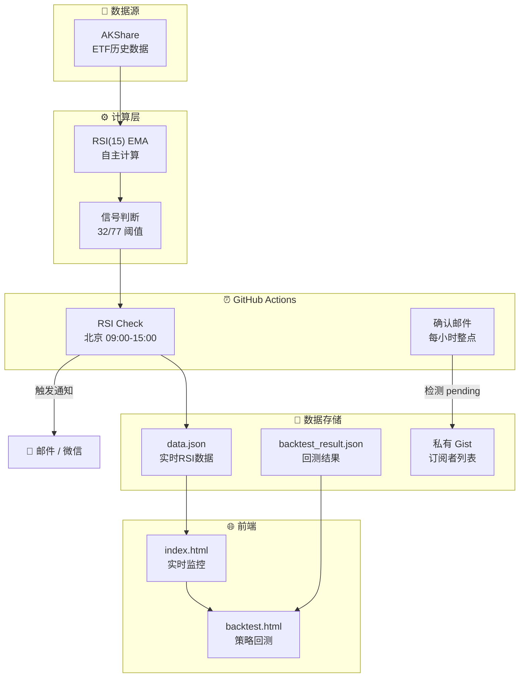

# 📈 JTrading - 基于RSI动量指标的ETF量化交易策略研究与实践

[](https://github.com/Pear56/JTrading/actions/workflows/rsi_check.yml)
[](https://github.com/Pear56/JTrading/actions/workflows/send_confirmation.yml)
[](https://pear56.github.io/JTrading/)
[](https://opensource.org/licenses/MIT)

**JTrading** 是一个基于 GitHub Actions 的 Serverless 量化交易辅助系统。通过对 RSI (Relative Strength Index) 技术指标的参数优化研究，在红利低波ETF (512890) 上实现了 **年化收益率 20.90%** 的回测表现，显著跑赢传统 RSI(14) 40/70 策略。

🔗 **在线体验**: [https://pear56.github.io/JTrading/](https://pear56.github.io/JTrading/)

---

## 📊 研究背景与方法

### 研究目标

传统 RSI 策略通常采用 Wilder 提出的 14 日周期配合 30/70 或 40/70 阈值，但这一参数组合是否为最优解？本研究旨在通过穷举优化方法，寻找特定资产类别下的最优 RSI 参数配置。

### 研究方法

1. **参数空间定义**
   - RSI 周期：3-24 日
   - 买入阈值：15-50
   - 卖出阈值：55-90
   - 约束条件：买卖阈值间隔 ≥ 10

2. **平滑算法对比**
   - **SMA 平滑**：传统简单移动平均
   - **EMA 平滑**：指数移动平均（对近期价格更敏感）

3. **交易模式对比**
   - **场内ETF交易**：模拟真实ETF交易（100份整手限制）
   - **联结基金模式**：允许小数份额申购（无整手限制）

4. **样本数据**
   - 红利低波ETF (512890)：2019-01-18 至 2025-11-28
   - 跨越 6.9 年完整市场周期（含 2020 疫情冲击、多次 A 股波动等）

---

## 🏆 核心研究发现

### 最优参数组合

经过 **27,720** 种参数组合的穷举测试，我们发现：

| 策略类型 | RSI周期 | 平滑方式 | 买入阈值 | 卖出阈值 | 总收益 | 年化收益 |
|:---------|:-------:|:--------:|:--------:|:--------:|-------:|--------:|
| **联结基金最优** | 15 | EMA | 32 | 77 | 268.02% | **20.90%** |
| 场内ETF最优 | 14 | SMA | 34 | 78 | 211.73% | 18.01% |
| 传统策略 | 14 | SMA | 40 | 70 | ~150% | ~14% |

> 💡 **关键洞察**：
> - **联结基金 vs 场内ETF**：联结基金可小数份额申购，避免了100份整手限制导致的资金利用率损失
> - **RSI(15) EMA** 比传统 RSI(14) SMA 更敏感，能捕捉更多交易机会
> - **32/77 阈值**比传统 40/70 更激进，在红利低波这类低波动资产上表现更优
> - 联结基金与场内ETF收益差异约 56%，主要源于整手交易限制

### 进阶策略：RSI+波动率动态调优

除了寻找固定的最优参数外，我们还引入了**波动率因子**来动态调整 RSI 的买卖阈值，以适应不同的市场环境。

**核心逻辑**：
- **高波动率环境**：市场情绪激动，价格波动剧烈。策略会自动**放宽**买卖条件（提高买入阈值，降低卖出阈值），以便更灵敏地捕捉快速反转的机会。
- **低波动率环境**：市场走势平稳。策略会自动**收紧**买卖条件，过滤掉微小的震荡噪音，避免频繁交易。

**算法实现**：
1. **波动率计算**：使用 47 日窗口计算对数收益率的年化波动率。
2. **动态阈值公式**：
   - $Buy = 34 - (-0.43) \times (Vol - 15)$
   - $Sell = 71 + (-0.43) \times (Vol - 15)$
   *(注：基准波动率设为 15%，k值为 -0.43)*
3. **边界约束**：买入阈值限制在 [20, 50]，卖出阈值限制在 [60, 90]。

**波动率计算细节**：
$$ \text{Volatility} = \text{StdDev}\left(\ln\left(\frac{P_t}{P_{t-1}}\right), 47\right) \times \sqrt{252} \times 100 $$
1. **对数收益率**：计算每日收盘价相对于前一日的自然对数收益率。
2. **滚动标准差**：取过去 **47个交易日**（约2个月）的对数收益率计算样本标准差。
3. **年化处理**：乘以 $\sqrt{252}$ 并转换为百分比。

**回测表现**：
该策略在回测中取得了 **286.4%** 的总收益和 **21.63%** 的年化收益，是目前表现最好的策略变体。

### 多策略对比分析

基于 2019-01-18 至 2025-11-28 的历史数据（约 6.9 年，2491 个自然日）：

| 策略/基准 | 总收益率 | 年化收益率 | 最大回撤 | 胜率 | 说明 |
|:----------|----------:|-----------:|---------:|-----:|:-----|
| **RSI+波动率 动态调优** | **+286.40%** | **21.63%** | 13.1% | 100% | 👑 动态阈值最优 |
| RSI(15) EMA 32/77 | +258.85% | 20.33% | 13.1% | 100% | 🥇 联结基金最优 |
| RSI(14) SMA 34/78 | +203.96% | 17.47% | 13.1% | 100% | 🥈 场内ETF最优 |
| RSI(14) SMA 36/78 | +199.52% | 17.22% | 13.1% | 100% | Top 3 策略 |
| 红利低波买入持有 | +133.86% | 13.09% | 18.6% | - | 被动基准 |
| 纳指ETF (159941) | +290.30% | 21.94% | 35.2% | - | 美股科技 |
| 标普500ETF (513500) | +195.88% | 17.12% | 28.4% | - | 宽基指数 |
| 沪深300ETF (510300) | +69.41% | 8.01% | 42.3% | - | A股大盘 |
| 黄金ETF (518880) | +135.21% | 13.16% | 15.2% | - | 避险资产 |

### 风险调整后收益

| 策略 | 收益/回撤比 | 夏普近似值 | 评价 |
|:-----|------------:|:----------:|:-----|
| RSI(15) EMA 32/77 | 10.59 | 0.83 | 联结基金风险收益比最优 |
| 买入持有（红利低波） | 7.52 | 0.55 | 低波动但收益一般 |
| RSI(14) SMA 34/78 | 7.81 | 0.66 | 场内ETF稳健选择 |

---

## ✨ 系统功能

### 1. 📊 现代化可视化看板
- **环形进度仪表盘**：RSI 数值一目了然
- **动态信号反馈**：实时显示买入/卖出/持有信号
- **金色优雅主题**：简约高级的视觉设计
- **深色模式支持**：自动适配系统主题
- **时间区间选择器**：自由筛选回测周期（1年/3年/5年/全部）

### 2. 📈 交互式策略回测
- **多策略对比**：同时展示 5+ 种策略收益曲线
- **多基准比较**：与纳指、标普500、沪深300、黄金等对比
- **完整交易记录**：每笔买卖操作可追溯
- **Chart.js 图表**：支持缩放、悬浮详情等交互

### 3. 🤖 全自动智能监控
- **交易时段运行**：北京时间 09:00-15:00 每小时执行
- **自主 RSI 计算**：使用 AKShare 获取数据，本地计算 RSI(15) EMA
- **数据持久化**：自动更新 `data.json` 驱动前端

### 4. 🔔 多渠道即时通知
- **邮件推送**：HTML 格式邮件，含策略参数和回测表现
- **微信提醒**：集成 Server酱

### 5. 📧 自动订阅管理
- **Cloudflare Worker**：边缘计算处理订阅请求
- **确认邮件**：新订阅者 1 小时内收到确认
- **双重保险**：Worker + Formspree 双重备份

---

## 🏗️ 系统架构



---

## 📂 项目结构

```text
trading_rsi_app/
├── .github/workflows/
│   ├── rsi_check.yml           # RSI 监控 (使用最优参数 RSI(15) 32/77)
│   └── send_confirmation.yml   # 确认邮件发送
├── backtest/
│   ├── rsi_backtest.py               # 回测引擎核心
│   ├── rsi_ideal_optimization.py     # 理想化参数优化
│   ├── generate_multi_strategy_data.py # 多策略数据生成
│   └── backtest_result.json          # 回测结果数据
├── cloudflare-worker/
│   ├── worker.js               # 订阅服务
│   └── wrangler.toml           # Worker 配置
├── docs/
│   ├── index.html              # 实时监控面板
│   ├── backtest.html           # 策略回测页面（含时间选择器）
│   ├── backtest_result.json    # 多策略回测数据
│   ├── config.js               # (自动生成) 订阅服务配置
│   └── data.json               # (自动生成) 实时 RSI 数据
├── github_action_runner.py     # RSI 监控核心脚本
├── send_confirmation.py        # 确认邮件发送脚本
└── requirements.txt            # Python 依赖
```

---

## 🚀 快速部署

### 1. Fork 项目
点击右上角 **Fork** 按钮。

### 2. 配置 GitHub Secrets
进入 **Settings** → **Secrets and variables** → **Actions** → **Secrets**：

| Secret 名称 | 必填 | 说明 |
|:------------|:----:|:-----|
| `SENDER_EMAIL` | ✅ | 发件邮箱 (如 `xxx@126.com`) |
| `SENDER_PASSWORD` | ✅ | SMTP 授权码 |
| `SUBSCRIBER_EMAILS` | ⚠️ | 接收通知邮箱 (逗号分隔) |
| `GIST_SUBSCRIBERS_URL` | ❌ | 私有 Gist 的 Raw URL |
| `GIST_TOKEN` | ❌ | Gist 只读 Token |
| `GIST_TOKEN_WRITE` | ❌ | Gist 读写 Token |
| `SUBSCRIBE_WORKER_URL` | ❌ | Cloudflare Worker URL |
| `SERVERCHAN_KEY` | ❌ | Server酱 Key (微信通知) |

### 3. 启用 GitHub Pages
1. 进入 **Actions**，手动运行一次 **"Daily RSI Check"**
2. 进入 **Settings** → **Pages**
3. Source 选择 `main` 分支，文件夹 `/docs`
4. 访问 `https://<用户名>.github.io/JTrading/`

---

## 📈 运行参数优化回测

```powershell
# 安装依赖
pip install pandas numpy akshare

# 运行基础回测
python backtest/rsi_backtest.py

# 运行参数优化（理想化模式）
python backtest/rsi_ideal_optimization.py

# 生成多策略对比数据
python backtest/generate_multi_strategy_data.py
```

### 策略规则

| 信号类型 | 条件 | 操作 |
|:---------|:-----|:-----|
| 买入信号 | RSI(15) EMA < 32 | 全仓买入 |
| 卖出信号 | RSI(15) EMA > 77 | 全仓卖出 |
| 持有 | 32 ≤ RSI ≤ 77 | 维持当前仓位 |

### RSI-EMA 计算公式

```python
# EMA 平滑因子
alpha = 1 / period

# 平均涨幅和跌幅（EMA）
avg_gain = gain.ewm(alpha=alpha, min_periods=period, adjust=False).mean()
avg_loss = loss.ewm(alpha=alpha, min_periods=period, adjust=False).mean()

# RSI 计算
RS = avg_gain / avg_loss
RSI = 100 - (100 / (1 + RS))
```

### 年化收益计算（复利）

$$\text{年化收益率} = \left(1 + \text{总收益率}\right)^{\frac{365}{\text{天数}}} - 1$$

---

## 🔬 研究结论

1. **参数敏感性**：RSI 周期 13-17 日区间表现稳健，过短（<10日）噪音大，过长（>20日）信号滞后

2. **平滑方法影响**：EMA 平滑对价格变化更敏感，在趋势明确时优于 SMA

3. **阈值选择**：
   - 激进策略（32/77）：高收益，适合联结基金（无整手限制）
   - 稳健策略（34/78）：收益略低但适合场内ETF实盘
   - 传统策略（40/70）：过于保守，错过大量交易机会

4. **交易模式差异**：
   - **联结基金**：可小数份额申购，资金利用率高，适合理论最优参数
   - **场内ETF**：100份整手限制，对小资金影响显著（约 20%+ 收益损耗）

5. **策略局限性**：
   - 单边上涨市场：RSI 长期处于高位，频繁触发卖出信号
   - 极端行情：突发事件导致的急跌可能触发错误买入
   - 样本偏差：需警惕过拟合风险

---

## 🛠️ 技术栈

| 类别 | 技术 |
|:-----|:-----|
| **前端** | HTML5, CSS3, JavaScript, Chart.js |
| **后端** | Python 3.9+, Pandas, NumPy, AKShare |
| **部署** | GitHub Actions, GitHub Pages |
| **边缘计算** | Cloudflare Workers |
| **数据存储** | GitHub Gist |

---

## ⚠️ 风险提示

> **免责声明**：本项目仅供学习研究，所有回测数据基于历史表现，**不保证未来收益**。
> 
> - 历史收益不代表未来表现
> - 量化策略存在失效风险
> - 美股 ETF 存在汇率波动风险
> - 投资有风险，入市需谨慎

---

## 📄 许可证

[MIT License](https://opensource.org/licenses/MIT) - 自由使用，但需保留版权声明。

---

## 🤝 贡献与交流

欢迎提交 Issue 和 Pull Request！

- 📧 Email: pear56@126.com
- 🐙 GitHub: [@Pear56](https://github.com/Pear56)

---

## 📚 参考文献

1. Wilder, J.W. (1978). *New Concepts in Technical Trading Systems*. Trend Research.
2. Murphy, J.J. (1999). *Technical Analysis of the Financial Markets*. New York Institute of Finance.
3. AKShare 文档: https://akshare.akfamily.xyz/
