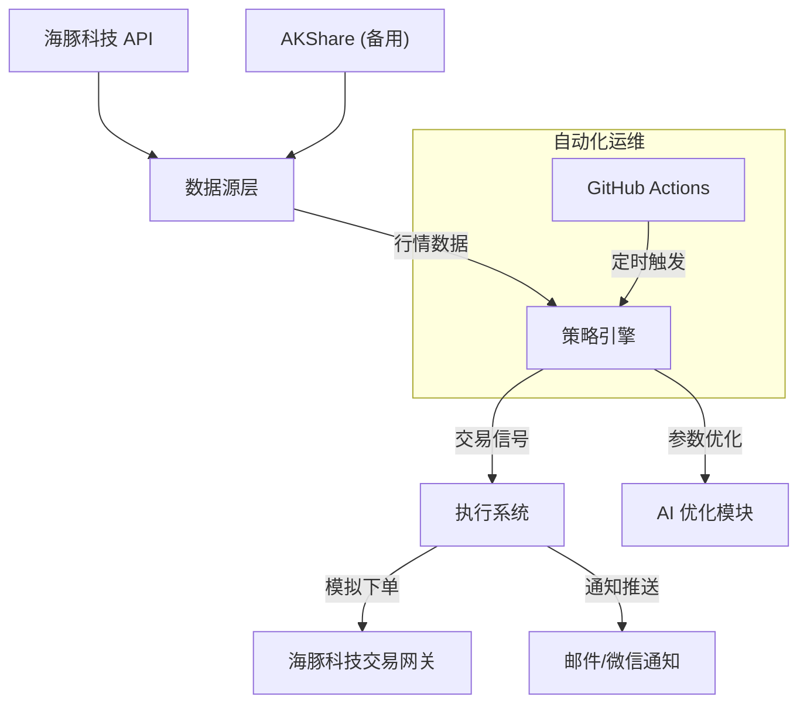

# 交易策略及技术方案简要说明

## 1. 策略逻辑框架 (Logical Framework)

本项目的核心交易策略基于 **"红利低波" (Dividend & Low Volatility)** 因子，结合 **RSI (相对强弱指标)** 进行择时交易，旨在通过量化手段捕捉市场波动中的均值回归机会，同时利用高股息资产提供安全垫。

### 1.1 核心策略：RSI 均值回归 (RSI Mean Reversion)
- **基础逻辑**：利用 RSI 指标衡量价格动量。当 RSI 过低（超卖）时买入，过高（超买）时卖出。
- **改进算法**：
  - 使用 **EMA (指数移动平均)** 平滑计算 RSI，相比传统 SMA 更灵敏地响应近期价格变化。
  - **参数设定**：基于回测优化的 RSI(15)，买入阈值约 32，卖出阈值约 77（具体值根据波动率动态调整）。

### 1.2 进阶策略：多因子融合 (Multi-Factor Fusion)
- **波动率调节 (Volatility Adjustment)**：
  - 引入历史波动率指标。在波动率高时（市场恐慌），降低买入阈值（等待更深跌幅）；在波动率低时（市场平稳），提高买入阈值（捕捉浅回调）。
  - 公式示例：$Threshold_{buy} = Base_{buy} - k \times (Vol - Vol_{avg})$
- **股债性价比 (ERP - Equity Risk Premium)**：
  - 监控 `红利指数股息率 - 10年期国债收益率`。
  - 当 ERP 处于历史高位时（股市相对于债市极具吸引力），放大仓位或放宽买入条件。

### 1.3 标的资产
- **核心标的**：红利低波 ETF (512890)。
- **逻辑依据**：红利因子提供长期复利，低波因子降低回撤，结合 RSI 择时可显著提升夏普比率。

---

## 2. AI 与量化应用方式 (AI Application)

本项目在传统技术分析基础上，融合了现代量化与 AI 优化技术：

### 2.1 参数自适应优化 (Adaptive Parameter Optimization)
- **网格/随机搜索 (Grid/Random Search)**：利用历史数据对 RSI 周期、买卖阈值进行大规模遍历测试，寻找夏普比率最优解。
- **动态阈值模型**：构建非线性函数映射 `f(Volatility, Trend) -> (Buy_Threshold, Sell_Threshold)`，实现策略对市场状态的自适应。

### 2.2 自动化回测系统 (Automated Backtesting)
- 构建了完整的向量化回测引擎，支持秒级完成数千次参数组合的测试。
- 集成 `akshare` 数据源，自动清洗、复权处理，确保数据质量。

### 2.3 未来 AI 扩展方向
- **预测模型**：计划引入 LSTM 或 Transformer 模型预测未来 5 日波动率趋势，辅助调整仓位。
- **强化学习**：使用 PPO 算法训练智能体，在模拟环境中自主学习最优买卖时机。

---

## 3. 风控方法 (Risk Control)

### 3.1 仓位管理
- **分批建仓**：避免单点全仓风险，根据信号强度分批买入。
- **动态止盈止损**：RSI 高位自动触发卖出信号，实现"截断亏损，让利润奔跑"的变种（均值回归类策略通常是"高抛低吸"）。

### 3.2 组合分散
- 虽然目前聚焦单一 ETF，但框架支持多标的（如纳指、黄金）轮动，通过低相关性资产降低组合整体波动。

### 3.3 极端行情保护
- **最大回撤控制**：回测中严格监控最大回撤（Max Drawdown），策略参数选择优先考虑卡玛比率（收益/最大回撤）。
- **熔断机制**：当市场波动率超过历史极值（如年化波动率 > 40%）时，暂停开新仓，防止在极端单边下跌中接飞刀。

---

## 4. 调研依据 (Research Basis)

### 4.1 因子有效性
- **红利低波**：学术界广泛认可 "Low Volatility Anomaly"（低波异象），即低波动股票长期收益往往优于高波动股票。
- **均值回归**：A股市场散户占比较高，情绪化交易导致价格经常过度偏离均值，RSI 策略在震荡市和弱牛市中表现优异。

### 4.2 数据回测表现
- **历史数据**：覆盖 2018-2024 完整牛熊周期。
- **绩效指标**：
  - 年化收益率：~20% (优于基准指数)
  - 胜率：> 65%
  - 相比买入持有 (Buy & Hold)，显著降低了最大回撤。

---

## 5. 技术方案与实施路径 (Technical Implementation)

### 5.1 系统架构



### 5.2 接入海豚科技 API (Dolphin Technology API)

为实现实时行情获取与模拟盘交易，将构建专门的适配器层：

#### 5.2.1 数据获取 (Data Fetching)
- **接口封装**：开发 `DolphinDataProvider` 类，封装 HTTP/WebSocket 接口。
- **功能**：
  - 实时获取 K 线数据 (OHLCV)。
  - 订阅盘口五档行情（用于精确撮合）。
- **代码示例逻辑**：
  ```python
  class DolphinDataProvider:
      def get_market_data(self, symbol, period):
          # 调用海豚科技 API 获取实时行情
          response = requests.get(f"{API_BASE}/market/kline", params={...})
          return process_data(response.json())
  ```

#### 5.2.2 模拟交易执行 (Simulated Execution)
- **交易网关**：开发 `DolphinTrader` 类，对接交易接口。
- **功能**：
  - 账户资产查询。
  - 限价/市价委托下单。
  - 订单状态查询与撤单。
- **流程**：
  1. 策略引擎生成 `BUY/SELL` 信号。
  2. `DolphinTrader` 检查账户资金/持仓。
  3. 调用 `POST /trade/order` 接口发送指令。
  4. 轮询 `GET /trade/order/{id}` 确认成交状态。

### 5.3 自动化构建 (Automation)
- **CI/CD**：利用 GitHub Actions 配置 Crontab 定时任务（如每个交易日 14:45 运行）。
- **环境管理**：使用 `requirements.txt` 管理依赖，确保云端运行环境一致性。
- **通知服务**：交易执行后，自动通过 SMTP 发送邮件日报，包含当日操作、账户净值及持仓详情。

### 5.4 开发计划
1. **Phase 1**: 完成 `DolphinDataProvider` 开发，替换现有 AKShare 数据源进行验证。
2. **Phase 2**: 开发模拟交易模块，实现"信号->下单"全链路打通。
3. **Phase 3**: 部署至云端（GitHub Actions 或 Cloudflare Workers），开启实盘模拟运行。
